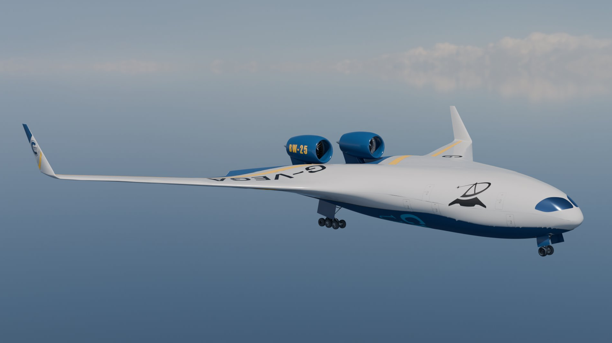
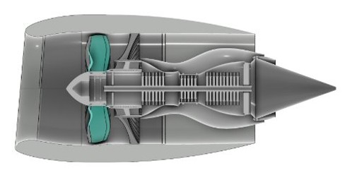
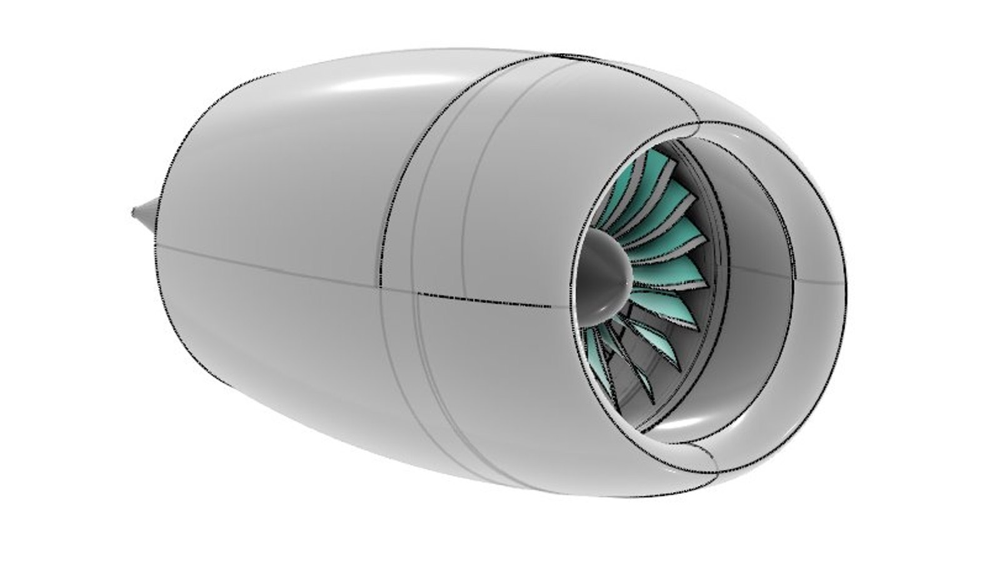
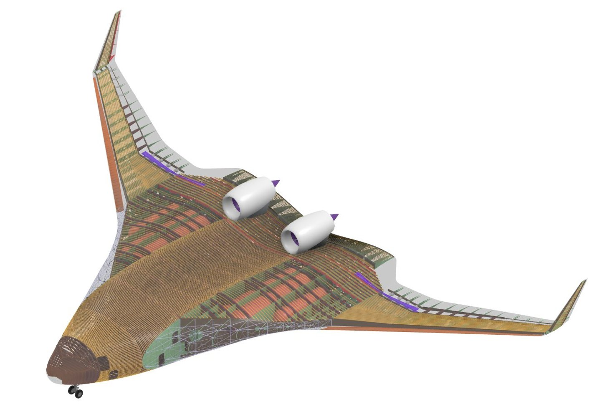
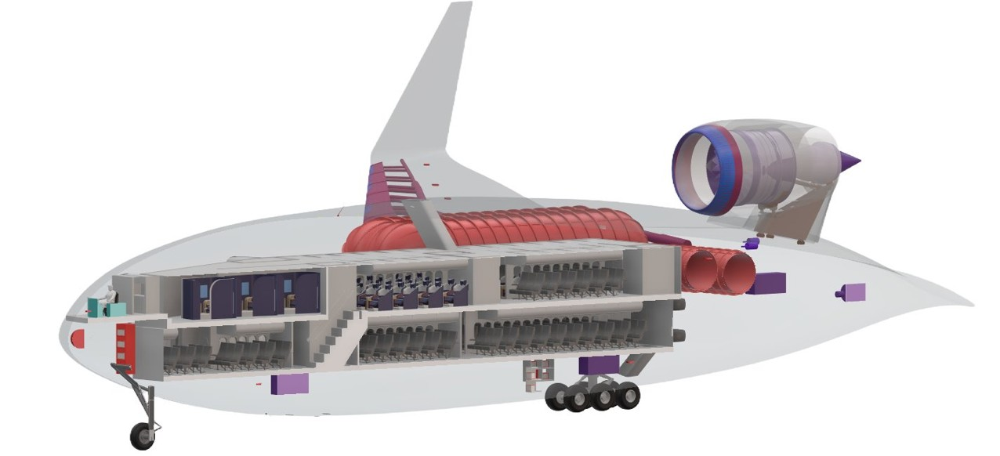

# G-VEGA: hydrogen-powered Blended Wing Body aircraft

Flagship group design project of the MSc in Aerospace Vehicle Design at Cranfield University, backed by Airbus: design a hydrogen-powered Blended Wing Body airliner to decarbonize long-haul aviation, in an international team of 62 students.

**This is a project showcase repository: a design project delivers CAD models and reports, not code.** The figures and the project report below document the work.

## My role

Engine integration lead: positioning the propulsion on a flying wing and meeting certification requirements, working closely with the other teams to reconcile everyone's constraints.

- Turbofan positioning, nacelle and thrust reverser design (SolidWorks, 3DEXPERIENCE).
- Trade-offs between interference drag, maintenance access and cabin noise.
- Compliance analysis with EASA CS-25 standards, notably the rotor burst hazard.

## Results

Configuration defended before a jury of industry experts at Cranfield.

## Figures

| | |
|---|---|
|  |  |
|  |  |

## Report

[Project report](report/memoire-BWB.pdf) (group deliverable).

## Context

Cranfield University, Aerospace Vehicle Design MSc, 2025 to 2026. More on my [portfolio](https://ugo-roccamatisi.github.io).
